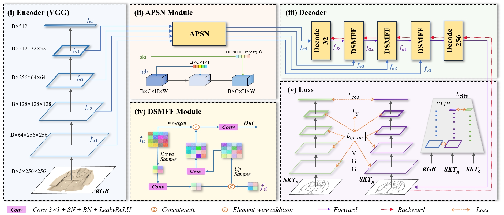
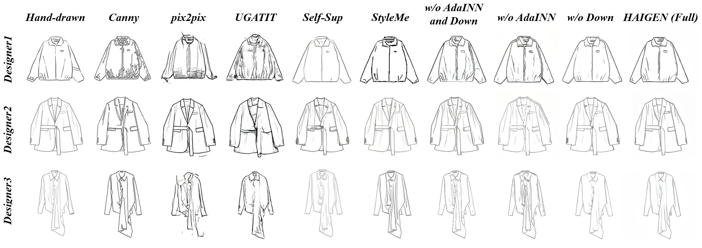

# HAIGEN
## [Part 02: Image-to-Sketch Local Module]

<div align=center></div>

<br>

***

Our model weights is avialable [**checkpoint**](https://drive.google.com/drive/folders/1-_ts9fbZsR7ZMy6I9fqu_hKV1hho_Ufa?usp=drive_link)

## 01 Data Preparation
For datasets that have paired sketch-image data, the path should be formatted as:
```yaml
./data/rgb/  # training reference (image)
./data/skt/  # training ground truth (sketch)
```
Our Image-to-Sketch Generation dataset is available [**Clothes-V1**](https://drive.google.com/file/d/1dPNQOaFYMRY2sxREs8Is-G3ltpi61Ftm/view?usp=drive_link).


## 02 Train and Test
### 1. Train
```yaml
python main.py
```

### 2. Test
```yaml
python evaluate.py
```
Note: you should change your checkpoint path.

### 3. Result

<div align=center></div>

<be>
<br>
