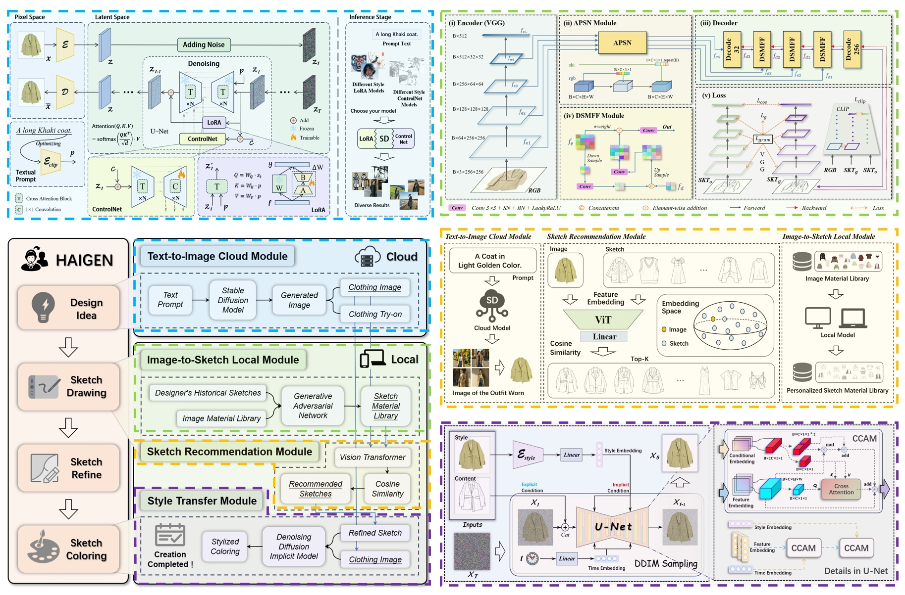
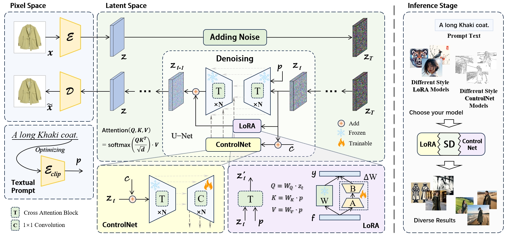
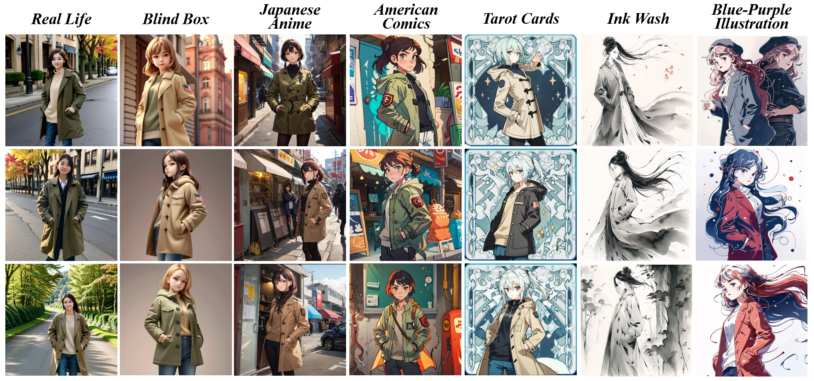

# HAIGEN: Towards Human-AI Collaboration for Facilitating Creativity and Style Generation in Fashion Design

## 🖼️ Framework

<div align=center></div>

<br>

You can find the [Demo Video](https://youtu.be/ijIJdaOUrlo).

***

The four modules in our framework are presented as follows：

## Part 01: Text-to-Image Cloud Module

🧩 It has been integrated into the [Wondershare AI Draw](https://aigc.wondershare.com/app/image-gen) 🤗

<be>

<div align=center></div>

<br>

<div align=center></div>

<br>

## Part 02: Image-to-Sketch Local Module

🧩 Please refer to the [I2S README](./I2S/) 🤗

## Part 03: Sketch Recommendation Module

🧩 Please refer to the [SIR README](./SIR) 🤗

## Part 04: Style Transfer Module

🧩 Please refer to the [S2I README](./S2I) 🤗

## 📜 Reference
If you find our code or dataset useful for your research, please cite our work. Thank you. 🥰🥰
```yaml
@article{jiang2024haigen,
  title={HAIGEN: Towards Human-AI Collaboration for Facilitating Creativity and Style Generation in Fashion Design},
  author={Jiang, Jianan and Wu, Di and Deng, Hanhui and Long, Yidan and Tang, Wenyi and Li, Xiang and Liu, Can and Jin, Zhanpeng and Zhang, Wenlei and Qi, Tangquan},
  journal={Proceedings of the ACM on Interactive, Mobile, Wearable and Ubiquitous Technologies},
  volume={8},
  number={3},
  pages={1--27},
  year={2024},
  publisher={ACM New York, NY, USA}
}
```

<br>
<br>
