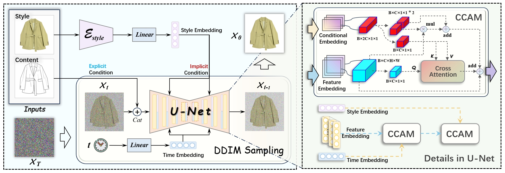
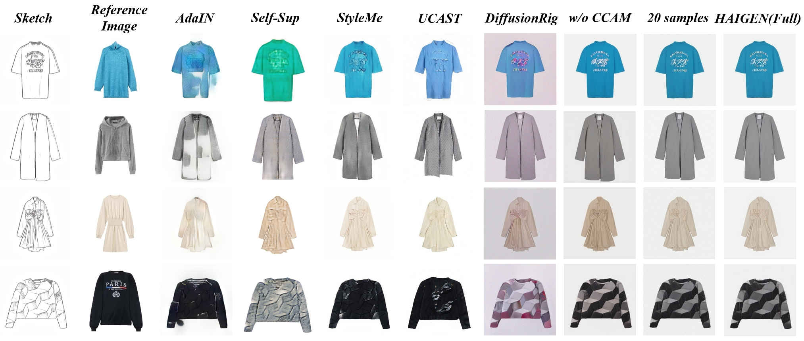

# HAIGEN 
## [Part 04: Style Transfer Module]

<div align=center></div>

<br>

***

Our model weights is avialable [**checkpoint**](https://drive.google.com/drive/folders/1buA1_4TSS8QaUhNH_om4PltAfo4mlFLR)

## 01 Data Preparation
For datasets that have paired sketch-image data, the path should be formatted as:
```yaml
./dataset/trainA/  # training reference (sketch)
./dataset/trainB/  # training ground truth (image)
./dataset/testA/  # testing reference (sketch)
./dataset/testB/  # testing ground truth (image)
```

Our Sketch-to-Image synthesis dataset is available [**HAIFashion**](https://drive.google.com/file/d/1Cy8I92VYnBEgWbpIvLsy5VcYPliJ1PON/view?usp=drive_link).


## 02 Train and Test
### 1. Train
run:
```yaml
python main.py
```

### 2. Test
run:
```yaml
python infer.py
```
Note: you should change your checkpoint path.

### 3. Result

<div align=center></div>

<be>
<br>
