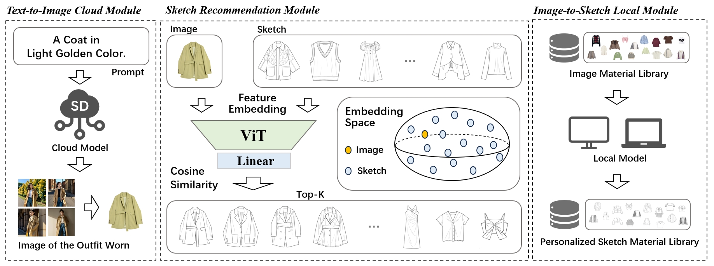

# HAIGEN 
## [Part 03: Sketch Recommendation Module]

<div align=center></div>

<br>

***

### 1. Train
run:
```yaml
python train.py
```
Note: you should change your checkpoint path.

### 2. Result

<div align=center></div>

<be>
<br>
